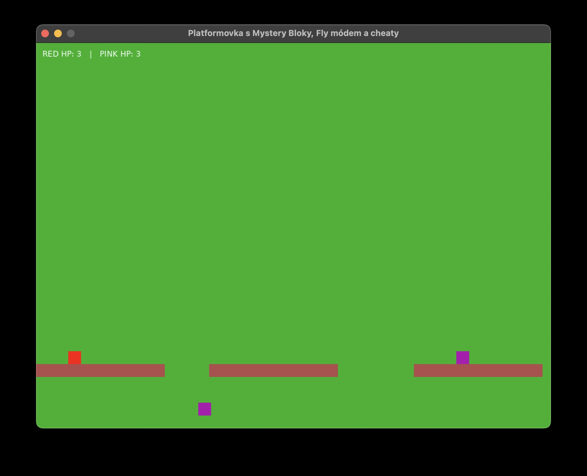

# Super Mario Vejlupek 

Funny Platformer project by Vali and Jasmi.

## How to run the game

1. Install love2d from [love2d.org](https://love2d.org/)
2. Clone the repository
    1. [Create GitHub account](https://github.com/signup)
    2. [Install Github Desktop](https://desktop.github.com/)
    3. [Clone the repository](https://github.com/elmariofredo/supermariovejlupek) by clicking Code > Local then Open with GitHub Desktop
3. Run the game by executing `love .` in the root directory of the repository see [love2d wiki](https://love2d.org/wiki/Getting_Started#Running_Games) for more information

